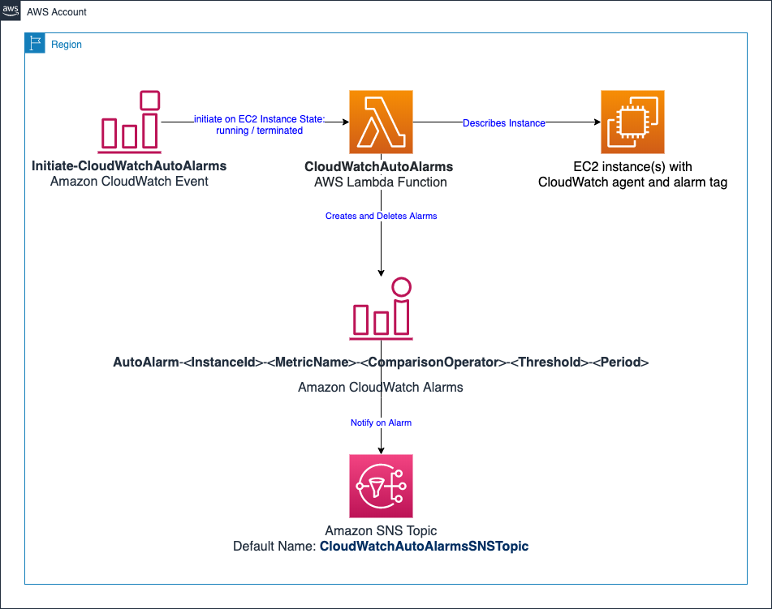

# CloudWatchAutoAlarms - Automatically create a set of CloudWatch alarms with tagging



The CloudWatchAutoAlarms AWS Lambda function enables you to quickly and automatically create a standard set of CloudWatch alarms for your Amazon EC2 instances or AWS Lambda functions using tags.  It prevents errors that may occur by manually creating alarms, reduces the time required to deploy alarms, and reduces the skills gap required in order to create and manage alarms.  It can be especially useful during a large migration to AWS where many resources may be migrated into your AWS account at once.

The solution supports multiple accounts with AWS Organizations and multiple regions.

The default configuration creates alarms for the following Amazon EC2 metrics for Windows, Amazon Linux, Redhat, Ubuntu, or SUSE EC2 instances:
*  CPU Utilization
*  CPU Credit Balance (For T Class instances)
*  Disk Space Used % (Amazon CloudWatch agent [predefined basic metric](https://docs.aws.amazon.com/AmazonCloudWatch/latest/monitoring/create-cloudwatch-agent-configuration-file-wizard.html))
*  Memory Used % (Amazon CloudWatch agent [predefined basic metric](https://docs.aws.amazon.com/AmazonCloudWatch/latest/monitoring/create-cloudwatch-agent-configuration-file-wizard.html))

The default configuration creates alarms for the following [AWS RDS metrics](https://docs.aws.amazon.com/AmazonRDS/latest/UserGuide/rds-metrics.html):

* CPU Utilization

Alarms are created for RDS clusters as well as RDS database instances.

The default configuration also creates alarms for the following [AWS Lambda metrics](https://docs.aws.amazon.com/lambda/latest/dg/monitoring-metrics.html#monitoring-metrics-types):

* Errors
* Throttles

You can change or add alarms by updating the **default_alarms** dictionary in [cw_auto_alarms.py](src/cw_auto_alarms.py).

The created alarms can be configured to notify an Amazon SNS topic that you specify using the **DEFAULT_ALARM_SNS_TOPIC_ARN** environment variable.  See the **Setup** section for details.

The Amazon CloudWatch alarms are created when an EC2 instance with the tag key **Create_Auto_Alarms** enters the **running** state and they are deleted when the instance is **terminated**.
Alarms can be created when an instance is first launched or afterwards by stopping and starting the instance.

The alarms are created and configured based on EC2 tags which include the metric name, comparison, period, statistic, and threshold.

The tag name syntax for AWS provided metrics is:

AutoAlarm-\<**Namespace**>-\<**MetricName**>-\<**ComparisonOperator**>-\<**Period**>-\<**EvaluationPeriods**>-\<**Statistic**>-\<**Description**>

Where:

* **Namespace** is the CloudWatch Alarms namespace for the metric.  For AWS provided EC2 metrics, this is **AWS/EC2**.  For CloudWatch agent provided metrics, this is CWAgent by default.
    You can also specify a different name as described in the **Configuration** section.
* **MetricName** is the name of the metric.  For example, CPUUtilization for EC2 total CPU utilization.
* **ComparisonOperator** is the comparison that should be used aligning to the ComparisonOperator parameter in the [PutMetricData](https://docs.aws.amazon.com/AmazonCloudWatch/latest/APIReference/API_PutMetricAlarm.html) Amazon CloudWatch API action.
* **Period** is the length of time used to evaluate the metric.  You can specify an integer value followed by s for seconds, m for minutes, h for hours, d for days, and w for weeks.  Your evaluation period should observe CloudWatch evaluation period limits.
* **EvaluationPeriods** is the number of periods on which to evaluate the alarm.  This property is optional and if it is left out, defaults to 1.
* **Statistic** is the statistic for the MetricName specified, other than percentile.
* **Description** is the description for the CloudWatch Alarm.  This property is optional, and if it is left out then a default description is used.

The tag value is used to specify the threshold.  You can also [create alarms for custom Amazon CloudWatch metrics](#alarming-on-custom-amazon-ec2-metrics).

For example, one of the preconfigured, default alarms that are included in the **default_alarms** dictionary is **AutoAlarm-AWS/EC2-CPUUtilization-GreaterThanThreshold-5m-1-Average-Created_by_CloudWatchAutoAlarms**.
When an instance with the tag key **Create_Auto_Alarms** enters the **running** state, an alarm for the AWS provided **CPUUtilization** CloudWatch EC2 metric will be created.
Additional alarms will also be created for the EC2 instance based on the platform and alarms defined in the **default_alarms** python dictionary defined in [cw_auto_alarms.py](src/cw_auto_alarms.py).

Alarms can be updated by changing the tag key or value and stopping and starting the instance.


## Setup

There are a number of settings that can be customized by updating the CloudWatchAutoAlarms Lambda function environment variables defined in the [CloudWatchAutoAlarms.yaml](./CloudWatchAutoAlarms.yaml) CloudFormation template.
The settings will only affect new alarms that you create so you should customize these values to meet your requirements before you deploy the Lambda function.
The following list provides a description of the setting along with the environment variable name and default value:

* **ALARM_TAG**: Create_Auto_Alarms
    * The CloudWatchAutoAlarms Lambda function will only create alarms for instances that are tagged with this name tag.  The default tag name is Create_Auto_Alarms.  If you want to use a different name, change the value of the ALARM_TAG environment variable.
* **CREATE_DEFAULT_ALARMS**: true
    * When true, this will result in the default alarm set being created when the **Create_Auto_Alarms** tag is present.  If set to false, then alarms will be created only for the alarm tags  defined on the instance.
* **CLOUDWATCH_NAMESPACE**: CWAgent
    * You can change the namespace where the Lambda function should look for your CloudWatch metrics. The default CloudWatch agent metrics namespace is CWAgent.  If your CloudWatch agent configuration is using a different namespace, then update the  CLOUDWATCH_NAMESPACE environment variable.
* **CLOUDWATCH_APPEND_DIMENSIONS**: InstanceId, ImageId, InstanceType, AutoScalingGroupName
    * You can add EC2 metric dimensions to all metrics collected by the CloudWatch agent.  This environment variable aligns to your CloudWatch configuration setting for [**append_dimensions**](https://docs.aws.amazon.com/AmazonCloudWatch/latest/monitoring/CloudWatch-Agent-Configuration-File-Details.html#CloudWatch-Agent-Configuration-File-Metricssection).  The default setting includes all the supported dimensions:  InstanceId, ImageId, InstanceType, AutoScalingGroupName
* **ALARM_IDENTIFIER_PREFIX**:  AutoAlarm
    * The prefix name that is added to the beginning of each CloudWatch alarm created by the solution.  (e.g. For "AutoAlarm":  (e.g. AutoAlarm-i-00e4f327736cb077f-CPUUtilization-GreaterThanThreshold-80-5m))  You should update this variable via the **AlarmIdentifierPrefix** in the [CloudWatchAutoAlarms.yaml](./CloudWatchAutoAlarms.yaml) CloudFormation template so that the IAM policy is updated to align with your custom name.

You can update the thresholds for the default alarms by updating the following environment variables:

**For Anomaly Detection Alarms**:
* **ALARM_DEFAULT_ANOMALY_THRESHOLD**: 2

**For Amazon EC2**:
* **ALARM_CPU_HIGH_THRESHOLD**: 75
* **ALARM_CPU_CREDIT_BALANCE_LOW_THRESHOLD**: 100
* **ALARM_MEMORY_HIGH_THRESHOLD**: 75
* **ALARM_DISK_PERCENT_LOW_THRESHOLD**: 20

**For AWS RDS**:
* **ALARM_RDS_CPU_HIGH_THRESHOLD**: 75

**For AWS Lambda**:
* **ALARM_LAMBDA_ERROR_THRESHOLD**: 0
* **ALARM_LAMBDA_THROTTLE_THRESHOLD**: 0

# Deployment
AWS Organizations support is required for multi-account with a single AWS Lambda Function deployment.

Deployment is supported for:
* #### Single account, single region
* #### Single account, multiple regions
* #### Multiple accounts within an AWS Organization, single region
* ##### Multiple accounts within an AWS Organization multiple regions

Follow the instructions below.  Specify the AWS Organization related parameters for multi-account support with AWS Organizations.

## Deploy the SNS topic for Alarm notifications  - [CloudWatchAutoAlarms-SNS.yaml](CloudWatchAutoAlarms-SNS.yaml) (Optional)

The [CloudWatchAutoAlarms-Config-SNS.yaml](CloudWatchAutoAlarms-Config-SNS.yaml) stack creates an SNS topic for alarm notifications configured by the CloudWatchAutoAlarms Lambda function. It allows single-account or multi-account AWS Organizations support.  If you want to support SNS notifications for the created alarms, you can deploy the template in each region you will use the solution.

#### Prerequisites
1. Ensure you have appropriate AWS credentials with permissions to create resources in the target AWS account.
2. Identify if you are deploying this for a single account or for an AWS Organization. If using multi-account AWS Organizations support, you will need the AWS Organization ID (e.g., `o-xxxxx`).

---

### Step-by-Step Deployment Instructions

Follow these steps for each region you want to support.

1. **Log in to the AWS Management Console**
   - Open the [AWS Management Console](https://aws.amazon.com/console/).
   - Log in using an account with permissions to deploy CloudFormation stacks.

2. **Navigate to the CloudFormation Console**
   - In the AWS Console, search for **CloudFormation** in the top search bar and select **CloudFormation**.

3. **Create a New Stack**
   - Click on the **Create stack** button and select **With new resources (standard)**.

4. **Upload the CloudFormation Template**
   - Under **Specify template**, choose **Upload a template file**.
   - Click **Choose file** and upload the `CloudWatchAutoAlarms-SNS.yaml` file.

5. **Specify Stack Details**
   - Provide a name for your stack, e.g., `cloudwatch-auto-alarms-sns`.
   - Fill in the parameters as follows:
      - **TargetOrganizationId**: If deploying for AWS Organizations, enter your AWS Organization ID (e.g., `o-xxxxx`). Leave blank for single-account deployment.

6. **Configure Stack Options**
   - (Optional) Add tags to help identify your stack resources.
   - Configure permissions, if necessary, to use an IAM role for stack deployment.
   - Leave other options at their default unless specific customization is required.

7. **Review the Configuration**
   - Review all the settings and parameters.
   - Acknowledge that AWS CloudFormation might create IAM resources with custom names by checking the appropriate box.

8. **Deploy the Stack**
   - Click **Create stack** to begin deployment.
   - Monitor the progress in the **Events** tab of your stack. The deployment will take a few minutes.

9. **Verify the Deployment**
   - Once the status shows **CREATE_COMPLETE**, go to the **Outputs** tab of the stack to retrieve the following:
      - **CloudWatchAutoAlarmsSNSTopicArn**: The ARN of the SNS topic created for alarm notifications.

---

### Additional Notes
- If **multi-account AWS Organizations support** is enabled by providing the `TargetOrganizationId` parameter, the stack sets up permissions for CloudWatch to publish alarms across all accounts in the specified AWS Organization.
- For single-account deployment, permissions are limited to the current AWS account.


## Deploy an S3 bucket for AWS Lambda function deployment package storage - [CloudWatchAutoAlarms-S3.yaml](CloudWatchAutoAlarms-S3.yaml)

#### Step 1: Log In to the AWS Console
1. Open your web browser and log in to your [AWS Management Console](https://aws.amazon.com/console/).
2. Ensure you are logged in with an IAM user or role that has **AdministratorAccess** or sufficient permissions to create S3 buckets and policies.

---

#### Step 2: Navigate to the CloudFormation Service
1. In the AWS Console, search for **CloudFormation** in the search bar and click on it to open the CloudFormation service.
2. Click the **Stacks** menu from the left-hand navigation bar.

---

#### Step 3: Deploy the CloudFormation Stack
1. Click the **Create stack** button, and choose **With new resources (standard)**.
2. Under **Specify template**, select **Upload a template file**.
3. Click **Choose file** and upload the [CloudWatchAutoAlarms-S3.yaml](./CloudWatchAutoAlarms-S3.yaml) file.
4. Click **Next** to proceed.

---

#### Step 4: Configure Stack Details
1. For **Stack name**, enter a meaningful name like `cloudwatch-auto-alarms-s3`.
2. Review any additional parameters or options (this template does not require input parameters).

---

#### Step 5: Configure Stack Options
1. You can add tags if needed to help manage your resources.
2. Leave the other options at their default values unless specific configurations are required.
3. Click **Next** to continue.

---

#### Step 6: Review and Create the Stack
1. Review the stack details and ensure everything is correct.
2. Acknowledge the required capabilities by checking the box for `I acknowledge that AWS CloudFormation might create IAM resources`.
3. Click **Create stack**.

---

#### Step 7: Verify the S3 Bucket Creation
1. Wait for the stack creation to complete. This might take a few minutes.
2. Once the status shows **CREATE_COMPLETE**, navigate to the **Outputs** tab.
3. Locate the output value `LambdaDeploymentBucketName` to confirm the S3 bucket name. The bucket will follow the naming pattern:
   ```
   cloudwatch-auto-alarms-<AWS_Account_ID>-<AWS_Region>
   ```
   
Take note of the deployment bucket name, it will be used in the next steps.

---

#### Additional Notes
- **Secure Access**: The S3 bucket includes policies to enforce secure transport (HTTPS) and block public object access. These configurations are automatically applied by the stack.
- **Lifecycle Rule**: Objects in the bucket are automatically deleted after 90 days to optimize storage costs.

This bucket is now ready to support Lambda deployment package storage for the CloudWatchAutoAlarms Lambda function. This bucket will be used in the next step for uploading the deployment packages as required.


### Create and Upload the AWS Lambda Deployment Package

#### Step 1: Update the Source Code (Optional)
1. Locate the source code file `cw_auto_alarms.py` in your project directory. This file contains the logic for creating and managing CloudWatch alarms.
2. Make any desired changes to the code to customize the alarms or functionality as per your requirements.
3. Save the file after making changes.

---

#### Step 2: Create the Deployment Package
1. Open a terminal or command prompt on your local machine.
2. Navigate to the directory containing the `src` folder of the project.
3. Run the following command to create a ZIP package for the Lambda function:
   ```bash
   zip -j amazon-cloudwatch-auto-alarms.zip src/*
   ```
   - The `-j` flag ensures that only the files are zipped, without preserving the folder structure.
   - This command will create a file named `amazon-cloudwatch-auto-alarms.zip` in the current directory.

---

#### Step 3: Log In to the AWS Management Console
1. Open your web browser and log in to your [AWS Management Console](https://aws.amazon.com/console/).
2. Ensure you are logged in with an IAM user or role that has permissions to upload objects to S3.

---

#### Step 4: Navigate to the S3 Service
1. In the AWS Console, search for **S3** in the search bar and click on it to open the S3 service.
2. Locate the S3 bucket you created in the previous step. The bucket name will typically follow the pattern:
   ```
   cloudwatch-auto-alarms-<AWS_Account_ID>-<AWS_Region>
   ```
   - You can confirm the bucket name from the **Outputs** tab of the `cloudwatch-auto-alarms-s3` CloudFormation stack.

---

#### Step 5: Upload the Deployment Package
1. Click on the name of the S3 bucket to open it.
2. Click the **Upload** button.
3. Under **Files**, click **Add files** and select the `amazon-cloudwatch-auto-alarms.zip` file from your local machine.
4. Under **Permissions**, ensure that the file is **not public** (this is typically enforced by default).
5. Click **Upload** to start the upload process.

---

#### Step 6: Verify the Upload
1. Once the upload is complete, confirm that the `amazon-cloudwatch-auto-alarms.zip` file appears in the bucket.
---

#### Step 7: Note the S3 Bucket and Key for CloudFormation
You will use the bucket name and file path (key) as parameters when deploying the `cloudwatch-auto-alarms` stack. These values are:
- **S3 Bucket Name**: The name of the bucket created earlier (e.g., `cloudwatch-auto-alarms-123456789012-us-east-1`).
- **S3 Deployment Key**: The full file path of the uploaded package (e.g., `amazon-cloudwatch-auto-alarms.zip`).

---

### Next Steps
Now that the deployment package has been uploaded, proceed to the next step to deploy the **CloudWatchAutoAlarms** stack using the uploaded Lambda deployment package.

## Deploy CloudWatchAutoAlarms AWS Lambda Function - [CloudWatchAutoAlarms.yaml](CloudWatchAutoAlarms.yaml)

#### Prerequisites
1. Ensure you have access to the AWS account where you want to automate alarm creation.
2. Confirm that you have the necessary permissions to:
    - Create IAM roles and policies.
    - Deploy Lambda functions.
    - Access CloudWatch and related services.
3. You will need the bucket name containing the Lambda deployment package (`amazon-cloudwatch-auto-alarms.zip`).

---

#### Deployment Steps

1. **Log In to the AWS Management Console**
    - Use your AWS credentials to log in.
    - Navigate to the account where the stack will be deployed.

2. **Go to CloudFormation**
    - In the AWS Management Console, search for and select **CloudFormation**.

3. **Create a New Stack**
    - Select **Create Stack** > **With New Resources (standard)**.

4. **Upload the Template**
    - Under the "Specify Template" section, choose **Upload a Template File**.
    - Click **Choose File** and select the provided CloudFormation YAML file (`CloudWatchAutoAlarms.yaml`).

5. **Specify Stack Details**
    - Enter a **Stack Name** (e.g., `cloudwatch-auto-alarms`).
    - Configure the following parameters:
        - **Memory**: Memory allocation for the Lambda function (default: 128 MB).
        - **EventState**: Choose `ENABLED` to activate CloudWatch Events immediately or `DISABLED` to activate them later.
        - **S3DeploymentBucket**: Enter the S3 bucket name containing the Lambda deployment package.
        - **S3DeploymentKey**: Provide the key for the Lambda deployment package (default: `amazon-cloudwatch-auto-alarms.zip`).
        - **EnableNotifications**: Select `true` to enable SNS notifications for alarms or `false` to disable them.  If you selext true, you must enter the SNSTopicName and SNSTopicAccount information.  The topic must exist in each region you wil support.
        - **SNSTopicName**: Enter the name of the SNS topic for alarm notifications (default: `CloudWatchAutoAlarmsSNSTopic`).
        - **SNSTopicAccount**: Enter the AWS Account ID where the SNS topic is created.  It should exist in each AWS region that you will use.
        - **AlarmIdentifierPrefix**: Enter a prefix for alarm names (default: `AutoAlarm`).
        - **TargetRegions**: Optionally provide a comma separated list of target AWS regions for deployment. (e.g. us-east-1,us-west-2)  The solution supports automatic alarm creation in multiple AWS regions.
        - **TargetOrganizationId**: If using AWS Organizations, provide the Organization ID.  
        - **TargetOrganizationalUnits**: Comma-separated list of Organizational Unit IDs for multi-account deployment.

6. **Configure Stack Options**
    - Add tags to help identify the stack (optional).

7. **Review and Deploy**
    - Review the parameters and options.
    - Acknowledge that CloudFormation will create IAM resources.
    - Click **Create Stack**.

8. **Monitor Deployment**
    - CloudFormation will initiate the stack creation process. Monitor the progress on the **Events** tab.
    - Ensure all resources are created successfully.

9. **Verify Deployment**
    - After the stack is successfully deployed:
        - Confirm the Lambda function `CloudWatchAutoAlarms` is created.

---

#### Additional Notes
- **Multi-Region and Multi-Account Support**:
    - For multi-region support, ensure the `TargetRegions` parameter specifies the desired regions.
- **Lambda Function Activation**:
    - The function `CloudWatchAutoAlarms` will automatically create alarms based on configured parameters.

## Required Steps for Multi-Account Support with AWS Organizations 

### Deploy Event Rules and Event Routing To Target AWS Organizational Units - [CloudWatchAutoAlarms-CrossAccountEvents.yaml](CloudWatchAutoAlarms-CrossAccountEvents.yaml)

### Prerequisites:
1. **Management or Delegated Administrator Account**:
    - The StackSet must be deployed from the **AWS Organizations Management account** or a **delegated administrator account**.

---

### Steps for Deployment

#### 1. Log in to the AWS Management Console:
- Use the credentials for the **Management Account** or a **delegated administrator account** of your AWS Organization.

---

#### 2. Navigate to the CloudFormation Console:
1. Open the [AWS CloudFormation console](https://console.aws.amazon.com/cloudformation/).
2. In the left-hand menu, click **StackSets**.

---

#### 3. Create a New StackSet:
1. Click the **Create StackSet** button.
2. Select **Upload a template file** and click **Choose file**.
3. Upload the provided **CloudWatchAutoAlarms-CrossAccountEvents.yaml** file.
4. Click **Next**.

---

#### 4. Specify StackSet Details:
1. **StackSet Name**: Enter a descriptive name, such as `cloudwatch-auto-alarms-events`.
2. **Parameters**:
    - Set the required parameters for your deployment:
        - **EventState**: (Default: ENABLED)
            - Choose whether CloudWatch Event rules are enabled or disabled.
        - **CloudWatchAutoAlarmsArn**: Provide the ARN of the Lambda function for CloudWatchAutoAlarms deployed in the previous step.  You can find this in the Outputs section of the deployed CloudFormation stack.  The ARN will be the following format:  `arn:aws:lambda:<region>:<account-id>:function:CloudWatchAutoAlarms`  Where `region` and `account-id` is the AWS region and AWS account id you deployed the CloudWatchAutoAlarm AWS Lambda function.
        - **CloudWatchAutoAlarmsEventBusArn**: Provide the ARN of the AWS Event Bus in the CloudWatchAutoAlarms account.  The ARN will be the following format: `arn:aws:events:<region>:<account-id>:event-bus/default` where `region` and `account-id` is the AWS region and AWS account id you deployed the CloudWatchAutoAlarm AWS Lambda function. 
    
3. Click **Next**.

---

#### 5. Configure Deployment Targets:
1. **Accounts**:
    - Choose **Deploy to OUs**.
    - Select the AWS Organizational Units (OUs) you want to support with the solution.
    - All accounts within these OUs will be targeted for deployment.

2. **Regions**:
    - Select the AWS regions where you want the StackSet deployed.
    - Ensure these regions match the operational scope of your CloudWatchAutoAlarms solution.

3. Click **Next**.

---

#### 6. Set Deployment Options:
1. **Execution Role**:
    - Ensure the required IAM roles are available in the target accounts.
    - CloudFormation will automatically assume these roles to deploy resources.

2. **Automatic Deployment**:
    - Enable **automatic deployment** to configure new accounts added to the specified OUs automatically.

3. Click **Next**.

---

#### 7. Review and Deploy:
1. Review all settings for your StackSet.
2. Click **Submit** to create the StackSet.

---

#### 8. Monitor StackSet Deployment:
1. Go to the **Operations** tab of the StackSet in the CloudFormation console.
2. Monitor the status of deployments across accounts and regions.
3. Address any failures by reviewing the error messages and correcting configurations or permissions.

---

#### Notes:
- **Service-Managed StackSet**: The deployment uses AWS CloudFormation's service-managed StackSet feature, enabling automatic support for new accounts added to the OUs.
- **EventBus Role**: The StackSet creates roles and permissions for EventBridge to allow cross-account event routing for managing CloudWatch alarms.
- **Updating StackSet**: If you need to modify the template or parameters, update the StackSet from the console.


### Deploy Cross-Account IAM Role for Alarm Management - [CloudWatchAutoAlarms-CrossAccountRole.yaml](CloudWatchAutoAlarms-CrossAccountRole.yaml)

### Overview
This step involves deploying a CloudFormation template to create a cross-account IAM role. This role is used by the **CloudWatchAutoAlarms AWS Lambda Function** to manage alarms across accounts within AWS Organizations. The deployment is restricted to one AWS region per target account because IAM roles are global resources.

### Prerequisites
1. You must be logged in to the AWS Management Console with an IAM user or role in the **AWS Organizations Management Account** or **Delegated Administrator Account**.
2. Identify the **AWS Organizational Units (OUs)** and **accounts** that you want to support with this solution.
3. Select one region where this role will be deployed for each account. Only one region is required as IAM roles are global.

---

### Deployment Steps

#### Step 1: Log in to AWS Management Console
1. Open your web browser and log in to the [AWS Management Console](https://aws.amazon.com/console/).
2. Ensure you are using an account with sufficient permissions to deploy CloudFormation stacks and manage IAM roles in the target accounts.

---

#### Step 2: Navigate to the CloudFormation Service
1. In the AWS Console, search for **CloudFormation** in the search bar and click on the service.
2. Select the **StackSets** option in the left navigation menu.

---

#### Step 3: Create a New StackSet
1. Click the **Create StackSet** button.
2. Under **Choose a template**, select **Upload a template file**.
3. Click **Choose file**, and upload the provided CloudFormation template file:
   - **[CloudWatchAutoAlarms-CrossAccountRole.yaml](./CloudWatchAutoAlarms-CrossAccountRole.yaml)**

4. Click **Next** to proceed.

---

#### Step 4: Specify StackSet Details
1. Enter a meaningful **StackSet name**, such as `cloudwatch-auto-alarms-crossaccountrole`.
2. Provide values for the template parameters:
   - **AlarmIdentifierPrefix**: Enter a prefix for CloudWatch alarm identifiers (e.g., `AutoAlarm`).
   - **CloudWatchAutoAlarmsAccount**: Enter the AWS Account ID where the CloudWatchAutoAlarms Lambda function is deployed.

3. Click **Next**.

---

#### Step 5: Set Deployment Options
1. Choose **Service-managed permissions** to enable automatic account and region deployments for AWS Organizations.
2. Specify the **AWS Organizational Units (OUs)** that should receive the stack deployment.
3. Select the **regions** where the stack should be deployed (only one region per account is needed for IAM roles).

---

#### Step 6: Configure Stack Options
1. Add tags if needed to help organize and manage your resources.
2. Leave other options as default unless specific configurations are required.

---

#### Step 7: Review and Deploy the StackSet
1. Review all configuration details, including parameters, regions, and OUs.
2. Acknowledge the required permissions by selecting:
   - `I acknowledge that AWS CloudFormation might create IAM resources with custom names.`
3. Click **Submit** to deploy the stack.

---

### Verification
1. After deployment, verify the status in the **StackSet Instances** tab.
2. Confirm the **CloudWatchAutoAlarmCrossAccountRole** is successfully created in each target account and region.

### Important Notes
- **Named Role**: The role is globally accessible within each AWS account but restricted by the naming convention `CloudWatchAutoAlarmCrossAccountRole`.
- **Role Usage**: This role is assumed by the CloudWatchAutoAlarms Lambda function to manage alarms for EC2, RDS, and Lambda resources.
- **Service-Managed Updates**: The StackSet automatically includes new accounts added to the specified OUs.

### Deploy AWS Organizations Management Account Role To Read AWS Organization Account List - [CloudWatchAutoAlarms-ManagementAccountRole.yaml](CloudWatchAutoAlarms-ManagementAccountRole.yaml)

This role is required to enable the **CloudWatchAutoAlarms** AWS Lambda function to retrieve the list of AWS accounts under your AWS Organization. The role must be deployed in the **AWS Organizations Management Account**.

---

### Deployment

### 1. Log In to the AWS Organizations Management Account
1. Open your web browser and log in to your [AWS Management Console](https://aws.amazon.com/console/).
2. Ensure you are logged in to the **AWS Organizations Management Account** with an IAM user or role that has **AdministratorAccess** or equivalent permissions.

---

### 2. Navigate to the CloudFormation Service
1. In the AWS Console, search for **CloudFormation** in the search bar and click to open the service.
2. Click the **Stacks** menu from the left-hand navigation bar.

---

### 3. Deploy the CloudFormation Stack
1. Click the **Create stack** button and choose **With new resources (standard)**.
2. Under **Specify template**, select **Upload a template file**.
3. Click **Choose file** and upload the `CloudWatchAutoAlarms-ManagementAccountRole.yaml` file.
4. Click **Next** to proceed.

---

### 4. Configure Stack Details
1. For **Stack name**, enter a meaningful name like `cloudwatch-auto-alarms-management-role`.
2. Configure the following parameter:
   - **CloudWatchAutoAlarmsAccountId**: Enter the AWS Account ID where the **CloudWatchAutoAlarms Lambda function** is deployed. This is the account that will assume the role created by this stack.

---

### 5. Configure Stack Options
1. (Optional) Add tags to help manage your resources, such as:
   - Key: `Project`, Value: `CloudWatchAutoAlarms`
   - Key: `Environment`, Value: `Production`
2. Leave other options at their default values unless specific configurations are required by your organization.
3. Click **Next** to continue.

---

### 6. Review and Create the Stack
1. Review the stack details to ensure all configurations are correct.
2. Acknowledge the creation of IAM resources by checking the box:  
   `I acknowledge that AWS CloudFormation might create IAM resources`.
3. Click **Create stack** to begin the deployment.

---

### 7. Verify the Stack Deployment
1. Wait for the stack status to change to **CREATE_COMPLETE**. This might take a few minutes.
2. Once the stack has completed, the role is ready for use by the **CloudWatchAutoAlarms Lambda function**.

---

### Notes
- **Role Purpose**: This role allows the Lambda function to call the AWS Organizations API to list all accounts and their parent OUs within the organization.
- **Named Role**: The role is named `CloudWatchAutoAlarmManagementAccountRole` and is a global IAM resource, meaning it does not need to be deployed to multiple regions.
- **Multi-Account Support**: Deploying this role ensures seamless integration of the **CloudWatchAutoAlarms Lambda function** with your AWS Organization, enabling it to target accounts dynamically.


## Activate

### Amazon EC2
In order to create the default alarm set for an Amazon EC2 instance or AWS Lambda function, you simply need to tag the Amazon EC2 instance or AWS Lambda function with the activation tag key defined by the **ALARM_TAG** environment variable.  The default tag activation key is **Create_Auto_Alarms**.

For Amazon EC2 instances, you must add this tag during instance launch or you can add this tag at any time to an instance and then stop and start the instance in order to create the default alarm set as well as any custom, instance specific alarms.

You can also manually invoke the CloudWatchAutoAlarms lambda function with the following event payload to create / update EC2 alarms without having to stop and start your EC2 instances:

```json
{
  "action": "scan"
}
```
You can do this with a test execution of the CloudWatchAUtoAlarms AWS Lambda function.  Open the AWS Lambda Management Console and perform a test invocation from the **Test** tab with the payload provided here.

The [CloudWatchAutoAlarms.yaml](CloudWatchAutoAlarms.yaml) template includes two CloudWatch event rules.  One invokes the Lambda function on `running` and `terminated` instance states.  The other invokes the Lambda function on a daily schedule.  The daily scheduled event will update any existing alarms and also create any alarms with wildcard tags. 

EC2 instances must have the CloudWatch agent installed and configured with [the basic, standard, or advanced predefined metric sets](https://docs.aws.amazon.com/AmazonCloudWatch/latest/monitoring/create-cloudwatch-agent-configuration-file-wizard.html) in order for the default alarms for custom CloudWatch metrics to work.  Scripts named [userdata_linux_basic.sh](./userdata_linux_basic.sh), [userdata_linux_standard.sh](./userdata_linux_standard.sh), and [userdata_linux_advanced.sh](./userdata_linux_advanced.sh) are provided to install and configure the CloudWatch agent on Linux based EC2 instances with their respective predefined metric sets.

### Amazon RDS

For Amazon RDS, you can add this tag to an RDS database cluster or database instance at any time in order to create the default alarm set as well as any custom alarms that have been specified as tags on the cluster or instance.


### AWS Lambda

For AWS Lambda, you can add this tag to an AWS Lambda function at any time in order to create the default alarm set as well as any custom, function specific alarms.


## Notification Support

You can define an Amazon Simple Notification Service (Amazon SNS) topic that the Lambda function will specify as the notification target for created alarms. The deployment instructions include an SNS topic that you can deploy and use with the solution.  You should deploy the SNS topic to each region that you want to support with this solution.  Amazon CloudWatch Alarms can't send notifications to SNS topics located in different regions.  

The solution also enables you to specify a unique SNS topic per AWS resource by setting a tag with key **`notify`** and the value set to the SNS topic ARN that should be targeted for alarms for that specific resource.  For any resources that don't have the **`notify`** tag set, the default SNS topic ARN will be used. 

You can apply a tagging strategy that includes the **`notify`** tag for groups of resources to notify on specific groups of resources.  For example, consider a tag with key **`Team`** and value **`Windows`**.  You could align tagging of this specific key / value with the SNS topic for Windows support(e.g. **`notify`**: arn:aws:sns:us-east-1:123456789012:WindowsSupport)

## Changing the default alarm set

You can add, remove, and customize alarms in the default alarm set.  The default alarms are defined in the **default_alarms** python dictionary in [cw_auto_alarms.py](src/cw_auto_alarms.py).

In order to create an alarm, you must uniquely identify the metric that you want to alarm on.  Standard Amazon EC2 metrics include the **InstanceId** dimension to uniquely identify each standard metric associated with an EC2 instance.  If you want to add an alarm based upon a standard EC2 instance metric, then you can use the tag name syntax:
AutoAlarm-AWS/EC2-\<**MetricName**>-\<**ComparisonOperator**>-\<**Period**>-\<**EvaluationPeriods**>-\<**Statistic**>-\<**Description**>
This syntax doesn't include any dimension names because the InstanceId dimension is used for metrics in the **AWS/EC2** namespace.  These AWS provided EC2 metrics are common across all platforms for EC2.

Similarly, AWS Lambda metrics include the **FunctionName** dimension to uniquely identify each standard metric associated with an AWS Lambda function.  If you want to add an alarm based upon a standard AWS Lambda metric, then you can use the tag name syntax:
AutoAlarm-AWS/Lambda-\<**MetricName**>-\<**ComparisonOperator**>-\<**Period**>-\<**EvaluationPeriods**>-\<**Statistic**>-\<**Description**>
You can add any standard Amazon CloudWatch metric for Amazon EC2 or AWS Lambda into the **default_alarms** dictionary under the **AWS/EC2** or **AWS/Lambda** dictionary key using this tag syntax.

## Wildcard support for dimension values on EC2 instance alarms

The solution allows you to specify a wildcard for a dimension value in order to create CloudWatch alarms for all dimension values.  This is particularly useful for creating alarms for all partitions and drives on a system or where the value of a dimension is not known or can vary across EC2 instances.

For example, the CloudWatch agent publishes the `disk_used_percent` metric for disks attached to a Linux EC2 instance.  The dimensions for this metric for Amazon Linux are `device name`, `fstype`, and `path`.

The alarm tag for this metric is hardcoded in the `default_alarms` python dictionary in `cw_auto_alarms.py` to create an alarm for the root volume whose default dimensions and values are: 

* device: nvme0n1p1
* fstype: xfs
* path: /

this is equivalent to the following default tag in the solution: 

```
AutoAlarm-CWAgent-disk_used_percent-device-nvme0n1p1-fstype-xfs-path-/-GreaterThanThreshold-5m-1-Average-Created_by_CloudWatchAutoAlarms
```

If you want to alarm on all disks attached to an EC2 instance then you must specify the device name, file system type, and path dimension values for each disk, which will vary.  Each EC2 instance may also have a different number of disks and different dimension values.

The solution addresses this requirement by allowing you to specify a wildcard for the dimension value.  For example, the Alarm tag for `disk_used_percent` For Amazon Linux specified in the `default_alarms` dictionary would change to:

```python
                {
                    'Key': alarm_separator.join(
                        [alarm_identifier, cw_namespace, 'disk_used_percent', 'device', '*', 'fstype', 'xfs', 'path',
                         '*', 'GreaterThanThreshold', default_period, default_evaluation_periods, default_statistic,
                         'Created_by_CloudWatchAutoAlarms']),
                    'Value': alarm_disk_used_percent_threshold
                },
```

This yields the equivalent alarm tag:

```
AutoAlarm-CWAgent-disk_used_percent-device-*-fstype-xfs-path-*-GreaterThanThreshold-5m-1-Average-Created_by_CloudWatchAutoAlarms
```

In this example, we have specified a wildcard for the `device` and `path` dimensions.  Using this example, the solution will query CloudWatch metrics and create an alarm for each unique device and path dimension values for each Amazon Linux instance.  

If your EC2 instance had two disks with the following dimensions:

*Disk 1*
* device: nvme0n1p1
* fstype: xfs
* path: /

*Disk 2*
* device: nvme1n1p1
* fstype: xfs
* path: /disk2

Then two alarms would be created using a `*` wildcard for the `device` and `path` dimensions:
* AutoAlarm-\<InstanceId>-CWAgent-disk_used_percent-device-nvme0n1p1-fstype-xfs-path-/-GreaterThanThreshold-80-5m-1p-Average-Created_by_CloudWatchAutoAlarms
* AutoAlarm-\<InstanceId>-CWAgent-disk_used_percent-device-nvme1n1p1-fstype-xfs-path-/disk2-GreaterThanThreshold-80-5m-1p-Average-Created_by_CloudWatchAutoAlarms


In order to identify the dimension values, the solution queries CloudWatch metrics to identify all metrics that match the fixed dimension values for the metric name specified.  It then iterates through the dimensions whose values are specified as a wildcard to identify the specific dimension values required for the alarm. 

Because the solution relies on the available metrics in CloudWatch, it will only work after the CloudWatch agent has published and sent metrics to the CloudWatch service.  Since the solution is designed to run on instance launch, these metrics will not be available on first start since the CloudWatch service will not have received them yet.  

In order to resolve this, you should schedule the solution to run on schedule using the `scan` payload:
```json 
{
"action": "scan"
}
```

This will provide sufficient time for the CloudWatch agent to publish metrics for new instances.  You can schedule the frequency of execution based on the acceptable timeframe for which wildcard based alarms for new instances are not yet created.


## Creating CloudWatch Anomaly Detection Alarms

CloudWatch Anomaly Detection Alarms are supported using the comparison operators `LessThanLowerOrGreaterThanUpperThreshold`, `LessThanLowerThreshold`, or `GreaterThanUpperThreshold`.

When you specify one of these comparison operators, the solution creates an anomaly detection alarm and uses the value for the tag key as the threshold.  Refer to the [CloudWatch documentation for more details on the threshold and anomaly detection](https://docs.aws.amazon.com/AmazonCloudWatch/latest/monitoring/CloudWatch_Anomaly_Detection.html).

CloudWatch Anomaly detection uses machine learning models based on the metric, dimensions, and statistic chosen.  If you create an alarm without a current model, CloudWatch Alarms creates a new model using these parameters from your alarm configuration.  
For new models, it can take up to 3 hours for the actual anomaly detection band to appear in your graph. It can take up to two weeks for the new model to train, so the anomaly detection band shows more accurate expected values.  Refer to the documentation for more details.

The solution includes commented out code for creating a CloudWatch Anomaly Detection Alarm for CPU Utilization in the `default_alarms` dictionary: 

```python
        # This is an example alarm using anomaly detection
        # {
        #     'Key': alarm_separator.join(
        #         [alarm_identifier, 'AWS/EC2', 'CPUUtilization', 'GreaterThanUpperThreshold', default_period,
        #          default_evaluation_periods, default_statistic, 'Created_by_CloudWatchAutoAlarms']),
        #     'Value': alarm_cpu_high_anomaly_detection_default_threshold
        # }
```

You can uncomment and update this code to test out anomaly detection support.  

The solution implements the environment variable `ALARM_DEFAULT_ANOMALY_THRESHOLD` as an example threshold you can use for your anomaly detection alarms.

## Alarming on custom Amazon EC2 metrics

Metrics captured by the Amazon CloudWatch agent are considered custom metrics.  These metrics are created in the **CWAgent** namespace by default.  Custom metrics may have any number of dimensions in order to uniquely identify a metric.  Additionally, the metric dimensions may be named differently based upon the underlying platform for the EC2 instance.

For example, the metric name used to measure the disk space utilization is named **disk_used_percent** in Linux and **LogicalDisk % Free Space** in Windows.  The dimensions are also different, in Linux you must also include the **device**, **fstype**, and **path** dimensions in order to uniquely identify a disk.  In Windows, you must include the **objectname** and **instance** dimensions.

Consequently, it is more difficult to automatically create alarms across different platforms for custom CloudWatch EC2 instance metrics.

The **disk_used_percent** metric for Linux has the additional dimensions:  **\'device', 'fstype', 'path'**.  For metrics with custom dimensions, you can include the dimension name and value in the tag key syntax:
AutoAlarm-\<**Namespace**>-\<**MetricName**>-\<**DimensionName-DimensionValue...**>-\<**ComparisonOperator**>-\<**Period**>-\<**EvaluationPeriods**>-\<**Statistic**>-\<**Description**>
For example, the tag name used to create an alarm for the average **disk_used_percent** over a 5 minute period for the root partition on an Amazon Linux instance in the **CWAgent** namespace is:
**AutoAlarm-CWAgent-disk_used_percent-device-xvda1-fstype-xfs-path-/-GreaterThanThreshold-5m-1-Average-exampleDescription**
Where the **device** dimension has a value of **xvda1**, the **fstype** dimension has a value of **xfs**, and the **path** dimension has a value of **/**.

This syntax and approach allows you to collectively support metrics with different numbers of dimensions and names.  Using this syntax, you can add alarms for metrics with custom dimensions to the appropriate platform in the **default_alarms** dictionary in [cw_auto_alarms.py](src/cw_auto_alarms.py)

You should also make sure that the **CLOUDWATCH_APPEND_DIMENSIONS** environment variable is set correctly in order to ensure that created alarms include these dimensions.  The lambda function will dynamically lookup the values for these dimensions at runtime.

If your dimensions name uses the default separator character '-', then you can update the **alarm_separator** variable in [cw_auto_alarms.py](src/cw_auto_alarms.py) with an alternative seperator character such as '~'.

## Create a specific alarm for a specific EC2 instance using tags

You can create alarms that are specific to an individual EC2 instance by adding a tag to the instance using the tag key syntax described in [changing the default alarm set](#changing-the-default-alarm-set).  Simply add a tag to the instance on launch or restart the instance after you have added the tag.  You can also update the thresholds for created alarms by updating the tag values, causing the alarm to be updated when the instance is stopped and started.

For example, to add an alarm for the Amazon EC2 **StatusCheckFailed** CloudWatch metric for an existing EC2 instance:
1. On the **Tags** tab, choose **Manage tags**, and then choose **Add tag**. For **Key**, enter **AutoAlarm-AWS/EC2-StatusCheckFailed-GreaterThanThreshold-5m-1-Average-exampleDescription**. For Value, enter **1**. Choose **Save**.
2. Stop and start the Amazon EC2 instance.
3. After the instance is stopped and restarted, go to the **Alarms** page in the CloudWatch console to confirm that the alarm was created.  You should find a new alarm named **AutoAlarm-<instance id omitted>-StatusCheckFailed-GreaterThanThreshold-1-5m-1p-exampleDescription**.

## Creating a specific alarm for a specific AWS Lambda function using tags

You can create alarms that are specific to an individual AWS Lambda function by adding a tag to the instance using the tag key syntax described in [changing the default alarm set](#changing-the-default-alarm-set).


## Security

See [CONTRIBUTING](CONTRIBUTING.md#security-issue-notifications) for more information.

## License

This library is licensed under the MIT-0 License. See the LICENSE file.
